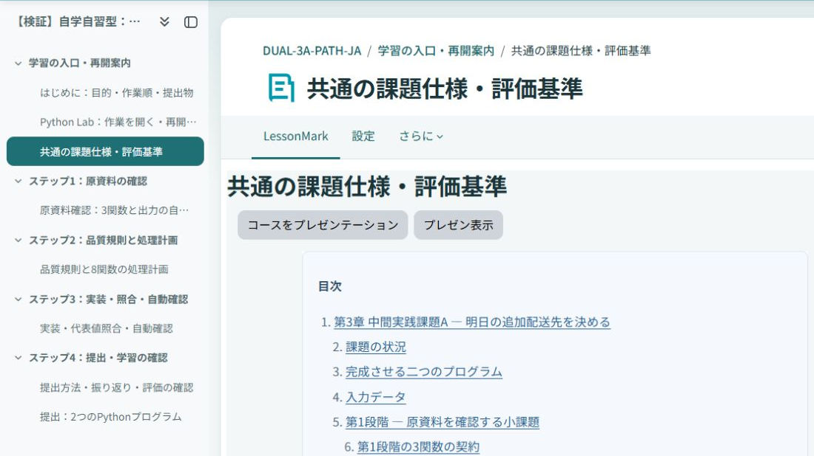
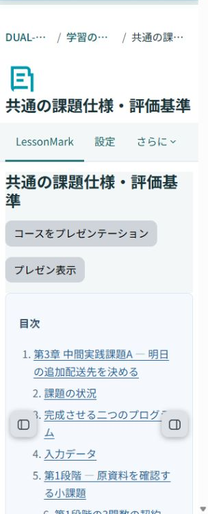

# Dual Learning theme

Dual Learning is a lightweight, content-first child theme for Moodle. It keeps Boost navigation and layouts while improving the readability and keyboard visibility needed by guided and self-paced courses.

The theme is independent of the optional [format_duallearning](https://github.com/ozekihiroshi/moodle-format_duallearning) course format and also works with Moodle's standard course formats.

## Features

- Inherits Moodle's standard Boost layouts and navigation.
- Adds a calm teal visual system, balanced spacing, and clear content surfaces.
- Gives keyboard focus a consistent visible outline.
- Keeps images, video, iframes, code blocks, wide tables, and diagrams usable on narrow screens.
- Adds a restrained reading typography layer for LessonMark, Page, and Book resources.
- Gives LessonMark presentation mode a wide teaching surface while keeping ordinary lesson pages comfortable to read.
- Gives the standard dashboard clearer card grouping without replacing Boost components.
- Uses local system fonts and adds no JavaScript, font download, CDN request, renderer override, or settings page.
- Stores no personal data and sends no data to an external service.

## Screenshots

| Learning workspace | Narrow learning content |
|---|---|
|  |  |

The screenshots use the public Dual Learning demonstration course and were captured with this theme selected. Browser chrome, account names, and notification controls are excluded.

## Installation

Install the release ZIP through **Site administration > Plugins > Install plugins**, or extract its single duallearning directory into Moodle's theme directory. Complete Moodle's standard plugin upgrade, then select **Dual Learning** through the theme selector.

No Composer, npm, or post-install build step is required.

Wide Mermaid diagrams in LessonMark and wide tables scroll within their own content region. In Page or Book, an author can preserve an unusually wide image by wrapping it in `
...
` in the HTML editor. Ordinary images remain responsive.

## Compatibility

The declared target is Moodle 5.2. The release candidate has been checked with PHP 8.3 and PHP 8.4 in CI and installed independently with MariaDB 11.8.

## Privacy

Dual Learning implements Moodle's Privacy API null provider. It stores no additional personal data.

## Licence

Copyright 2026 Hiroshi Ozeki.

This plugin is free software: you can redistribute it and/or modify it under the terms of the GNU General Public License, either version 3 of the License, or any later version.
